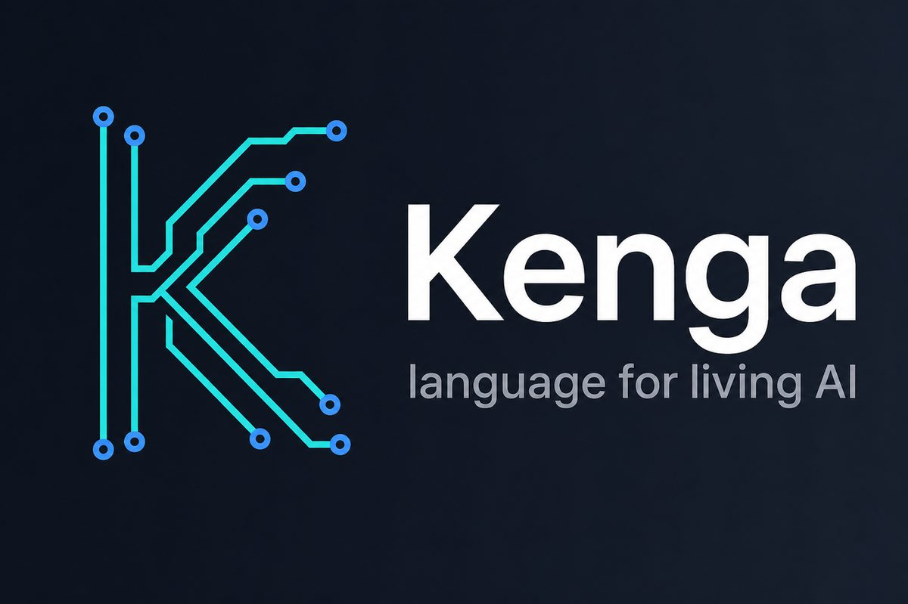
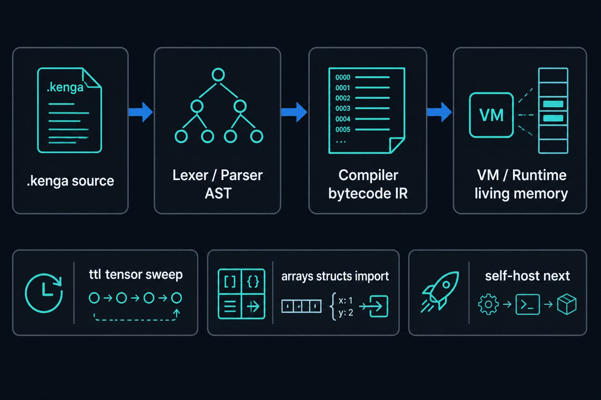
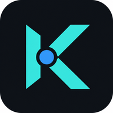

<p align="center">
  
</p>

<p align="center">
  <strong>Kenga</strong> — язык программирования для живого ИИ<br/>
  память · предсказание · агенты · локальный инференс
</p>

<p align="center">
  <a href="https://github.com/GermannM3/kenga-lang/actions/workflows/ci.yml"></a>
  <a href="LICENSE"></a>
  <a href="https://github.com/GermannM3/kenga-lang/releases"></a>
  
</p>

---

## Зачем Kenga

Обычные стеки для ML — это Python-клей вокруг C++/CUDA. Rust уже лучше для инференса, но всё ещё язык общего назначения.

**Kenga** проектируется как язык, где тензор, время жизни памяти (`ttl`), консолидация и агентный цикл — не библиотеки, а часть семантики.

Сейчас в репозитории — **bootstrap 1.2**: синтаксис → AST → bytecode → VM, `emit-c` / `kenga build`, Prophet mind + `kenga talk`.  
Rust здесь только временный **хост компилятора** (как C у раннего Go). Программы пишутся на Kenga, Python не нужен. Цель — self-host: компилятор на самой Kenga.

<p align="center">
  
</p>

---

## Установка на ПК

Пока это «сайт установки». Отдельный домен и пакетные менеджеры (`winget`, `brew`, crates.io) появятся, когда язык стабилизируется.

### Вариант A — через Cargo (проще всего)

Нужен [Rust](https://rustup.rs/) (1.75+).

```bash
cargo install --git https://github.com/GermannM3/kenga-lang --locked
kenga version
```

### Вариант B — из исходников

```bash
git clone https://github.com/GermannM3/kenga-lang.git
cd kenga-lang
cargo build --release
./target/release/kenga run examples/hello.kenga
```

Windows (PowerShell):

```powershell
git clone https://github.com/GermannM3/kenga-lang.git
cd kenga-lang
cargo build --release
.\target\release\kenga.exe run examples\hello.kenga
```

### Вариант C — бинарники с Releases

1. Открой [Releases](https://github.com/GermannM3/kenga-lang/releases)
2. Скачай архив под свою ОС (`linux` / `windows` / `macos`)
3. Положи `kenga` в `PATH`

Теги `v*` собираются GitHub Actions автоматически (Linux, Windows, macOS Intel/ARM).

---

## Быстрый старт

```bash
kenga run examples/hello.kenga
kenga run examples/showcase.kenga
kenga run examples/agent.kenga
kenga run examples/prophet.kenga
kenga run examples/train.kenga
kenga run examples/unroll.kenga
kenga run examples/neuromodel.kenga   # чистая нейромодель на Kenga
kenga run examples/persist_mind.kenga # обучить и сохранить minds/agent.km
kenga talk minds/agent.km             # поговорить с world-model
kenga chat minds/agent.km --script examples/chat_session.txt
kenga run examples/selfhost/arith.kenga  # self-host seed
kenga emit-c examples/native_lists.kenga -o native_lists.c
kenga build examples/native_struct.kenga   # emit-c + gcc/clang
kenga compile examples/living.kenga        # bytecode IR
kenga eval "println(2 + 2);"
```

Минимальная программа:

```kenga
fn main() -> i64 {
    println("hello from kenga");
    return 0;
}
```

Чуть живее — списки, структуры, диапазоны, living memory:

```kenga
import "../stdlib/math.kenga";

struct Point { x: i64, y: i64 }

fn main() -> i64 {
    let p = Point { x: 3, y: 4 };
    let xs = [1, 2, 3];

    for i in 0..5 {
        if i == 3 { continue; }
        println(i);
    }

    let flash: Tensor ttl 2s = tensor(2, 2);
    sweep();
    assert(abs(0 - 7) == 7);
    return p.x * p.x + p.y * p.y;
}
```

Агентский цикл (`observe → think → act`):

```kenga
on "sense"(x: i64) {
    println(x);
    if x < 3 { emit("sense", x + 1); }
}

fn main() -> i64 {
    emit("sense", 0);
    return pump(16);
}
```

Память Пророка (без catastrophic forgetting):

```kenga
fn main() {
    let mind = memory();
    remember_next(mind, [1, 2, 3], [2, 3, 4], 50);
    learn(mind, [1, 2, 3], [2, 3, 4]);
    consolidate(mind);
    println(predict(mind, [1, 2, 3]));
    println(unroll(mind, [1, 2, 3], 5)); // будущее на 5 шагов
}
```

---

## Что уже есть в языке

| Возможность | Статус |
|---|---|
| Функции, `if` / `else`, `while`, `for` / `in` | ✅ |
| `break` / `continue` | ✅ |
| Списки `[…]`, индекс `a[i]`, `len` / `push` | ✅ |
| Диапазоны `0..n` | ✅ |
| `struct` + литералы + поля | ✅ |
| `import "path.kenga"` | ✅ |
| Living types: `ttl 5s`, `sweep` | ✅ |
| Event loop: `on` / `emit` / `pump` | ✅ |
| Память Пророка: `memory` / `remember` / `consolidate` | ✅ |
| World model: `learn` / `predict` / `remember_next` | ✅ |
| MLP residual world-model + `unroll` / `foresee_n` | ✅ |
| `round` (скаляр / list) для eval предсказаний | ✅ |
| Пример `examples/neuromodel.kenga` (train→sleep→predict) | ✅ |
| `save_mind` / `load_mind` + `kenga talk`/`chat` | ✅ |
| Self-host seed: `examples/selfhost/arith.kenga` | ✅ |
| Self-host mini vars: `examples/selfhost/mini.kenga` | ✅ |
| Self-host if/cmp: `examples/selfhost/iffy.kenga` | ✅ |
| `to_str` / `input` / `ord` | ✅ |
| `emit-c`: i64, lists, structs, for/while, fn, import | ✅ |
| `kenga build` (emit-c + системный C-компилятор) | ✅ |
| `Tensor`, `typeof`, `assert`, `sleep_ms` | ✅ |
| Bytecode IR (`kenga compile`) | ✅ |
| Полный LLVM / self-host | 🚧 next |

<p align="center">
  
</p>

---

## Команды CLI

```
kenga run <file.kenga>              VM
kenga talk [mind.km] [--script f]   диалог с обученным mind
kenga parse|compile <file.kenga>    AST / IR
kenga emit-c <file.kenga> [-o out.c]
kenga build <file.kenga> [-o out] [--keep-c]
kenga eval '<code>'
kenga version
```

---

## Структура репозитория

```
kenga-lang/
├── src/           # bootstrap: lexer → parser → compiler → VM
├── examples/      # hello, living, showcase, prophet, native_*
├── stdlib/        # math, list, agent
├── tests/         # интеграционные тесты языка
├── docs/          # LANGUAGE.md
├── assets/        # баннер и схемы для README
└── .github/       # CI + release builds
```

---

## Roadmap

Bootstrap 1.0 закрыт (VM + native C + Prophet memory + events). Дальше:

1. LLVM / полноценный нативный бэкенд  
2. Self-host — компилятор Kenga на Kenga  
3. Пакетные менеджеры и отдельный сайт


Связанные проекты автора: [KengaAI_Engine](https://github.com/GermannM3/KengaAI_Engine), [The-Prophet](https://github.com/GermannM3/The-Prophet), [kengarust](https://github.com/GermannM3/kengarust).

---

## Участие

Issues и PR приветствуются. Для локальной проверки:

```bash
cargo test
cargo run -- run examples/showcase.kenga
```

---

## Лицензия

[MIT](LICENSE) © Kenga AI / [GermannM3](https://github.com/GermannM3)
